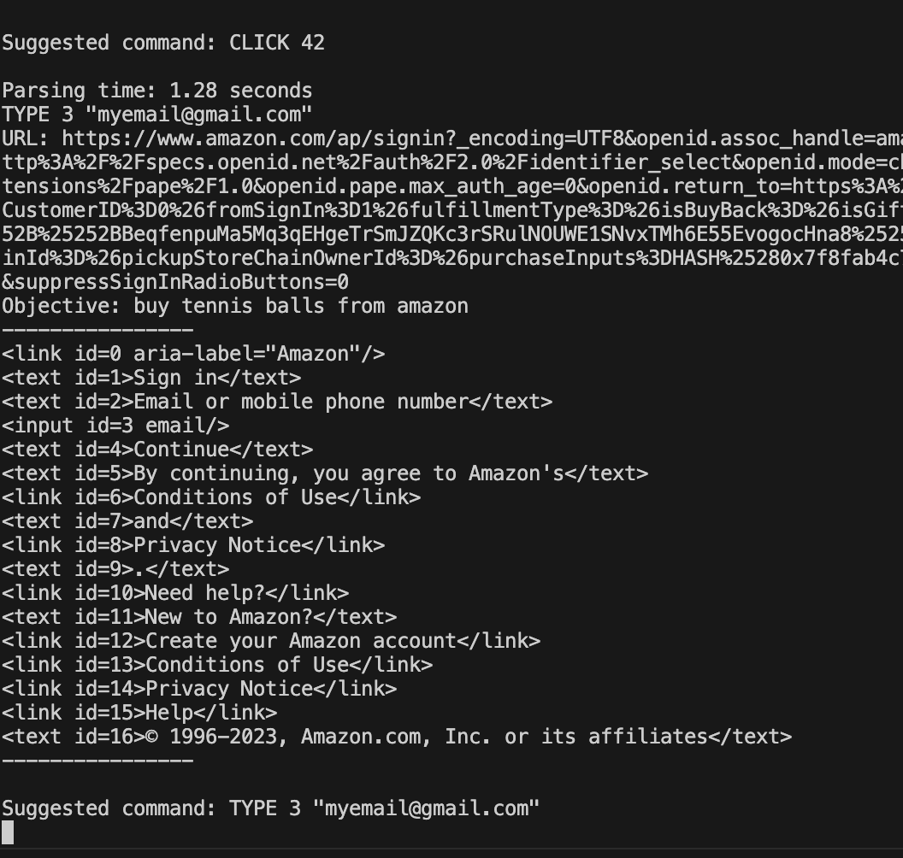

# 2. Browsing Agent

## To-do
1. Install dependencies
```bash
cd season2-onboarding-projects/week2
pip3 install -r requirements.txt
```
2. Setup OpenAI API
- Add API Key at openai_api.py
```python
openai.api_key = "OpenAI API Key"
```
- Or add to .env file in root folder
```bash
OPENAI_KEY=sk-
```

## Examples
1. [natbot](https://github.com/nat/natbot/tree/main)
  - October 2022
2. [AutoGPT](https://github.com/Significant-Gravitas/Auto-GPT)
    - March 2023
    - [HTML Extractor](https://github.com/Significant-Gravitas/Auto-GPT/blob/master/autogpt/processing/html.py)

## Example Tasks
1. Browsing Automation
    1. 다음주 금요일에 강남역 CGV에서 오후 8시 인근에 인디아나존스 2명 예약해줘
        - CGV 계정 등 필요한 정보 prompt로 알려주거나 Bot이 유저한테 물어보도록 하기
    2. 배민에서 지금 강남역 인근 피자 맛있는거 배달해줘
        - 태스크에 필요한 추가 정보가 있으면 물어보는지 확인
            - 어디로 배달하면 될까요?
            - 피쟈집 / 피자 종류 이 중에서 선택해주세요
3. General Problem Solving
    1. 트위터에서 활동하면서 한 시간안에 팔로워 100명 만들어봐

## Challenges
1. Hallucination



## Suggestions
1. Select a domain
    - Search at CGV homepage initially
2. Include required info beforehand
    - Account info, etc
3. Prompt the agent to only use information that were explicitly give by the user and ask for more specific info for clarification and completing the task